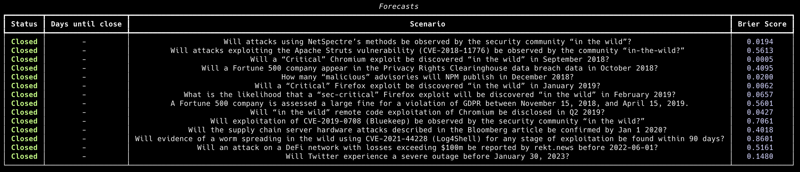

# forecast

A command-line tool for tracking and scoring personal forecasts. Track your predictions over time and measure your forecasting accuracy using various probability distributions.



## Installation


Create a virtual environment (unless you want to install globally), activate it, and install the package

```bash
python -m venv env
source env/bin/activate
pip install git+https://github.com/magoo/forecast.git
```

Then run the CLI

```bash
forecast
```

The first run will ask to create a `.forecasts` directory, if one is not found. Take a look at [the examples](https://github.com/magoo/forecast/tree/main/.forecasts) to get started with `.forecast` files.

## Usage

`forecast` will look for a `.forecasts` directory wherever it is ran, then show and score all existing `.forecast` files within. If `.forecasts` directory does not exist, it will prompt for creation. Please note that the `.forecasts` directory is plural, and `.forecast` files are not. 

```bash
forecast
```

Filter forecasts by tag:

```bash
forecast --tag <tag>
```

Show all forecasts by type:

```bash
forecast --type <type>
```
## Forecast Types

The tool supports several types of probabilistic forecasts.  PERT, LogNormal, and Pareto are distributions that are built around values you supply. 

- **Choice**: Discrete choices with assigned probabilities
- **Interval**: Min/max range with confidence level
- **PERT**: Three-point estimation (min/mode/max)
- **LogNormal**: 5, 50, and 95% percentiles.
- **Pareto**: Power law distribution

## Creating Forecasts

Create `your_filename.forecast` files in your `.forecasts` directory. They look a lot like [Frontmatter](https://jekyllrb.com/docs/frontmatter/) files, with specific keys for metadata. Example:

```markdown
---
scenario: "Will it rain tomorrow?"
end_date: 2024-12-31
type: choice
options:
"Yes": 0.7
"No": 0.3
---

Some markdown text describing whether it will rain tomorrow.
```

Examples for each type of forecast (`choice`, `interval`, `lognormal`, `pareto`, `pert`) are in the `.forecasts` directory in the repo.